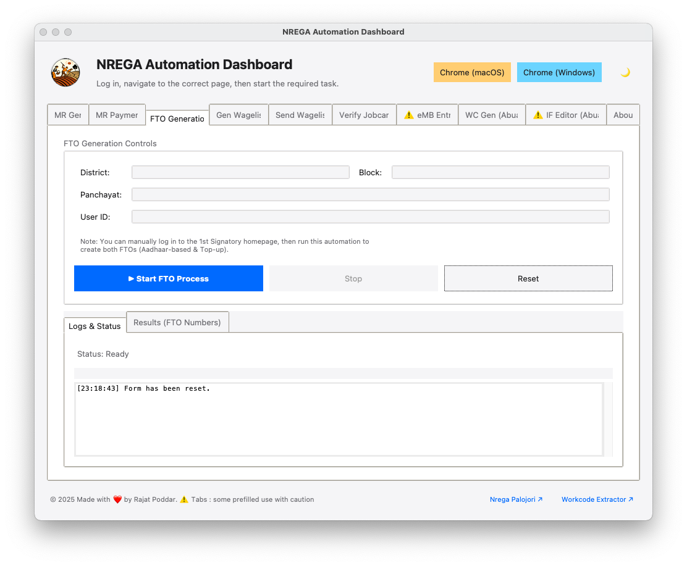
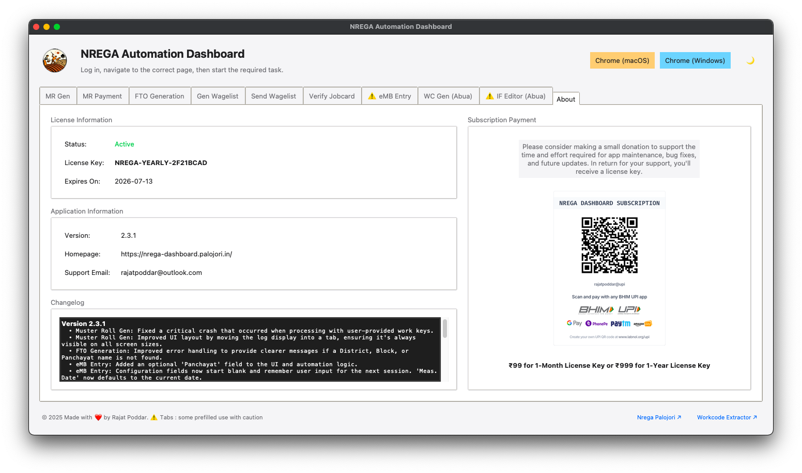
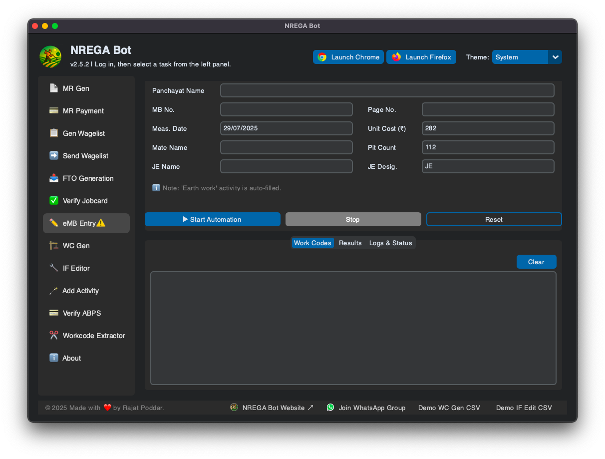

  
  <h1 align="center">NREGA Automation Dashboard</h1>
  
<b>Version 2.2.0 | Automate repetitive NREGA portal tasks with ease!</b>

---

## 📌 Overview

The **NREGA Automation Dashboard** is a powerful desktop tool built with Python and Tkinter that automates various **repetitive data entry and processing tasks** on the [NREGA portal](https://nrega.nic.in). It interacts with a web browser (Google Chrome) to simplify your daily workflow.

This tool is designed for users who handle large volumes of data and want to reduce manual effort and save significant time.

---

## 🚀 Features

🧭 An intuitive, tab-based interface for each automation task:
- 🗂️ **MR Generator** – Automatically generates and downloads Muster Roll PDFs.
- ✍️ **MR Fill & Absent** – Pre-fills Muster Rolls and marks the 7th day absent, then pauses for your manual review and save.
- 🆕 **FTO Generation** – Generate FTO for both Aadhar based & Top-up Automatically with detailed FTO No. on results.
- ⚙️ **MSR Processor** – Fills & saves Muster Rolls for a list of work codes with detailed results.
- 🧾 **Generate Wagelist** – Creates wagelists automatically by processing all available items.
- 📤 **Send Wagelist** – Marks generated wagelists for e-FMS payment processing.
- 💳 **Jobcard Verify & Photo** – Verifies all job cards for a village and intelligently uploads the correct family photo from a folder.
- 📏 **eMB Entry** – Automates Measurement Book (eMB) entry for multiple work codes.
- 🛠️ **Workcode Generator (Abua)** – Creates new Abua Awas work codes in bulk from a CSV file.
- 💧 **IF Editor (Abua)** – Automates the multi-page Irrigation Facility (IF) editing process from a CSV.
- 🎨 **Dark/Light Theme Toggle** – For a comfortable UI experience.

---

## 🛠 Prerequisites

Before using the app, you only need to have **Google Chrome** installed.
- 🌐 [Google Chrome](https://www.google.com/chrome/)

---

## ⚙️ Installation & Setup

### 1️⃣ Download the Application
Download the latest version for your operating system from the project's website or releases page.

- **For Windows**: Download `NREGA-Dashboard-Windows.exe`
- **For macOS**: Download `NREGA-Dashboard-macOS.dmg`

Place the downloaded application file in a convenient folder.

### 2️⃣ First-Time Launch
When you run the app for the first time, it will automatically start a **30-day free trial**. No license key is needed to begin.

---

## ▶️ Running the Application

1.  **Close All Chrome Windows:** Before starting, make sure Google Chrome is completely closed.
2.  **Launch the Dashboard App:** Double-click the `NREGA-Dashboard` application file.
3.  **Launch Chrome from the App:**
    - Click the **"Chrome (macOS)"** or **"Chrome (Windows)"** button at the top-right of the dashboard.
    - This will open a special, controlled Chrome window. This is the **only** window the automation will work with.
4.  **Log In:** In the newly opened Chrome window, log in to the NREGA portal with your credentials.
5.  You are now ready to start automating!

---

## 📘 Usage Guide

1.  🧭 Launch the dashboard and use the in-app buttons to open the special Chrome window.
2.  🔐 Log in to the NREGA portal manually inside that Chrome window.
3.  🔀 Select the automation tab you want to use (e.g., MSR Processor, Wagelist Gen, etc.).
4.  📋 Fill in the required details (like Panchayat name) and paste your work codes or select a file.
5.  ✅ Click the **Start** button for that tab.
6.  🔍 Monitor the real-time progress in the "Logs & Status" area.
7.  🛑 Click **Stop** at any time to safely halt the current process.

---

## ⚠️ Disclaimer

> ⚡ This tool interacts with a **live government website**.  
> 🔄 If the portal's structure or element IDs change, some features may break until updated.  
> 🛠️ Use this tool responsibly. The author provides no warranties and is not liable for any data entry errors. Always double-check automated work.

---

## 📸 Screenshots

     

---

## 🧑‍💻 Author

**Rajat Poddar** 🔗 [GitHub](https://github.com/rajatpoddar)

---

## 🪄 License

This project is licensed under the MIT License - see the LICENSE file for details.
