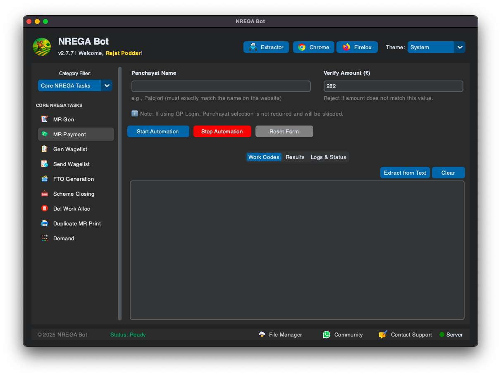

<p align="center">
  
  <h1 align="center">NREGA Automation Dashboard</h1>
  <p align="center"><b>Automate repetitive NREGA portal tasks with ease!</b></p>
</p>

---

## 📌 Overview

The **NREGA Automation Dashboard** is a powerful desktop tool built with Python and Tkinter that automates various **repetitive data entry tasks** on the [NREGA portal](https://nrega.nic.in). It interacts with a web browser (Google Chrome) to simplify tasks like:

- ✔️ Muster Roll (MSR) Processing  
- ✔️ Wagelist Generation & Submission  
- ✔️ Work Code Creation from CSV  
- ✔️ Measurement Book Entry  
- ✔️ IF Edit Automation  

---

## 🚀 Features

🧭 Organized into multiple tabs for each task:
- 🗂 **MSR Processor** – Fills & saves Muster Rolls for work codes  
- 🧾 **Generate Wagelist** – Creates wagelists automatically  
- 📤 **Send Wagelist** – Marks them for e-FMS payment  
- 🛠 **Workcode Generator** – From CSV input  
- 📏 **eMB Entry** – Automates Measurement Book entry  
- 💧 **IF Editor** – Multi-page automation from CSV  
- 🎨 **Dark/Light Theme Toggle** – Sleek UI experience  

---

## 🛠 Prerequisites

Before using this app, install the following:

- 🐍 [Python 3.8+](https://www.python.org/downloads/)
- 🌐 [Google Chrome](https://www.google.com/chrome/)

---

## ⚙️ Installation & Setup

### 1️⃣ Download Project Files
Clone or download all source files (`main_app.py`, `config.py`, `tabs/`, etc.) into a single folder.

### 2️⃣ Install Dependencies

Open **Command Prompt / Terminal**, navigate to your folder, and run:

```bash
pip install -r requirements.txt
```

### 3️⃣ Launch Chrome in Remote Debugging Mode

This app connects to Chrome via remote debugging.

#### 🪟 For Windows:
1. Create a new desktop shortcut with this as the path:

```
"C:\Program Files\Google\Chrome\Application\chrome.exe" --remote-debugging-port=9222 --user-data-dir="C:\ChromeProfileForNREGA"
```

2. Name it `NREGA Chrome` and always use it to launch Chrome before starting the app.

#### 🍎 For macOS:
Run this in Terminal:

```bash
/Applications/Google\ Chrome.app/Contents/MacOS/Google\ Chrome --remote-debugging-port=9222 --user-data-dir="$HOME/ChromeProfileForNREGA"
```

> ⚠️ Make sure all other Chrome instances are closed before using remote mode.

---

## ▶️ Running the Application

```bash
python main_app.py
```

> Ensure Chrome is open in debugging mode before launching the app.

---

## 📘 Usage Guide

1. 🧭 Launch Chrome (debug mode)
2. 🔐 Log in to NREGA portal manually
3. 🖥 Run the app: `python main_app.py`
4. 🔀 Select a tab (MSR, Wagelist, etc.)
5. 📋 Paste work codes or upload a CSV
6. ✅ Click **Start Automation**
7. 🔍 Monitor progress via the log area
8. 🛑 Click **Stop** to halt anytime

---

## ⚠️ Disclaimer

> ⚡ This tool interacts with a **live government website**.  
> 🔄 If the portal structure changes, some features may break.  
> 🛠 Use responsibly. No warranties provided.

---

## 📸 Screenshots *(optional)*

```
 (assests/Generate_Wagelist.png) (assests/Send_Wagelist.png) (assests/eMB_entry.png) (assests/Workcode_Abuwa.png) (assests/IF_Editor_Abuwa.png)
```

---

## 🧑‍💻 Author

**Rajat Poddar**  
🔗 [GitHub](https://github.com/rajatpoddar)

---

## 🪄 License

MIT License – Free to use, modify, and distribute.
